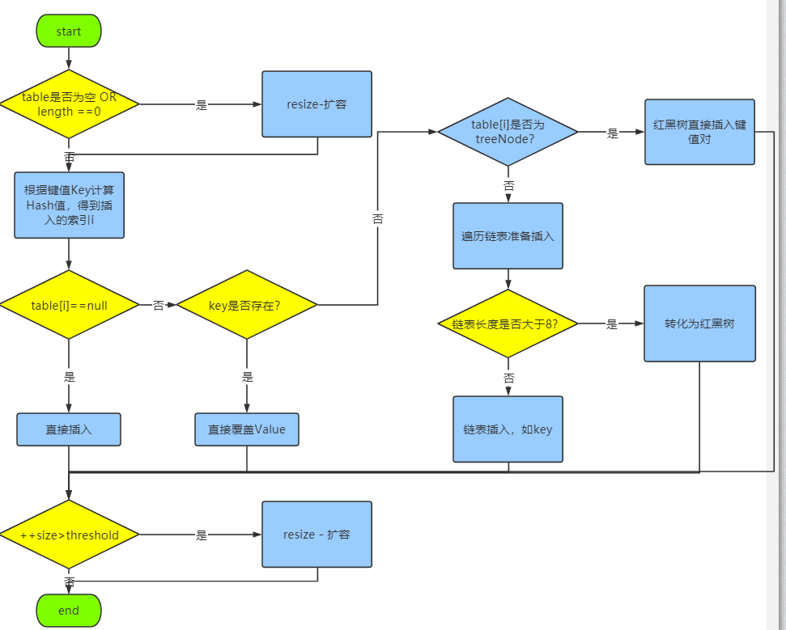

## Java集合

### 1.说说java常见的集合有哪些？

collection接口和map接口是所有集合类的父接口。

collection接口的子接口有list和set；

map接口的实现类有HashMap、TreeMap、HashTable、CurrentHashMap等

list接口的实现类有ArrayList、LinkedList、Vector和Stack。

set接口的实现类有HashSet、TreeSet、LinkedHashset等。

### 2. HashMap与HashTable的区别？

- hashMap是线程不安全的，HashTable由于加了synchronize关键字，所以是线程安全的。
- hashmap允许K/V是都为null，hashTable的K/V都不允许为空。
- HashMap继承自AbstractMap类，HashTable继承自Dictionary类。


### 3. HashMap的put方法的具体流程？

HashMap插入数据的流程如下图：



首先，HashMap是由数组+链表+红黑树实现的（JDK1.8之前是用的数组+链表）。`table`为数组，`length`为数组长度。threshold是数组的阈值。

1. 首先判断数组是否为空，或者


### 4. HashMap的扩容操作是怎么实现的？

```java
/**
 * 该函数有2中使用情况：1.初始化哈希表；2.当前数组容量过小，需要扩容
 oldTab，老哈希表
 oldCap，老长度
 oldThr，老阈值
 */
final Node<K,V>[] resize() {
    Node<K,V>[] oldTab = table;// 扩容前的数组（当前数组）
    int oldCap = (oldTab == null) ? 0 : oldTab.length;// 扩容前的数组容量（数组长度）
    int oldThr = threshold;// 扩容前数组的阈值
    int newCap, newThr = 0;

    if (oldCap > 0) {
        // 针对情况2：若扩容前的数组容量超过最大值，则不再扩容
        if (oldCap >= MAXIMUM_CAPACITY) {
            threshold = Integer.MAX_VALUE;
            return oldTab;
        }
        // 针对情况2：若没有超过最大值，就扩容为原来的2倍（左移1位）
        else if ((newCap = oldCap << 1) < MAXIMUM_CAPACITY &&
                oldCap >= DEFAULT_INITIAL_CAPACITY)
            newThr = oldThr << 1; // double threshold
    }

    // 针对情况1：初始化哈希表（采用指定或者使用默认值的方式）
    else if (oldThr > 0) // initial capacity was placed in threshold
        newCap = oldThr;	//初始化当前阈值
    else {               // zero initial threshold signifies using defaults
        newCap = DEFAULT_INITIAL_CAPACITY;
        newThr = (int)(DEFAULT_LOAD_FACTOR * DEFAULT_INITIAL_CAPACITY);
    }

    // 计算新的resize上限
    if (newThr == 0) {
        float ft = (float)newCap * loadFactor;
        newThr = (newCap < MAXIMUM_CAPACITY && ft < (float)MAXIMUM_CAPACITY ?
                (int)ft : Integer.MAX_VALUE);
    }
    threshold = newThr;
    @SuppressWarnings({"rawtypes","unchecked"})
    Node<K,V>[] newTab = (Node<K,V>[])new Node[newCap];
    table = newTab;
    if (oldTab != null) {
        // 把每一个bucket都移动到新的bucket中去
        for (int j = 0; j < oldCap; ++j) {
            Node<K,V> e;
            if ((e = oldTab[j]) != null) {
                oldTab[j] = null;
                if (e.next == null)
                    newTab[e.hash & (newCap - 1)] = e;
                else if (e instanceof TreeNode)
                    ((TreeNode<K,V>)e).split(this, newTab, j, oldCap);
                else { // preserve order
                    Node<K,V> loHead = null, loTail = null;
                    Node<K,V> hiHead = null, hiTail = null;
                    Node<K,V> next;
                    do {
                        next = e.next;
                        if ((e.hash & oldCap) == 0) {
                            if (loTail == null)
                                loHead = e;
                            else
                                loTail.next = e;
                            loTail = e;
                        }
                        else {
                            if (hiTail == null)
                                hiHead = e;
                            else
                                hiTail.next = e;
                            hiTail = e;
                        }
                    } while ((e = next) != null);
                    if (loTail != null) {
                        loTail.next = null;
                        newTab[j] = loHead;
                    }
                    if (hiTail != null) {
                        hiTail.next = null;
                        newTab[j + oldCap] = hiHead;
                    }
                }
            }
        }
    }
    return newTab;
}
```

